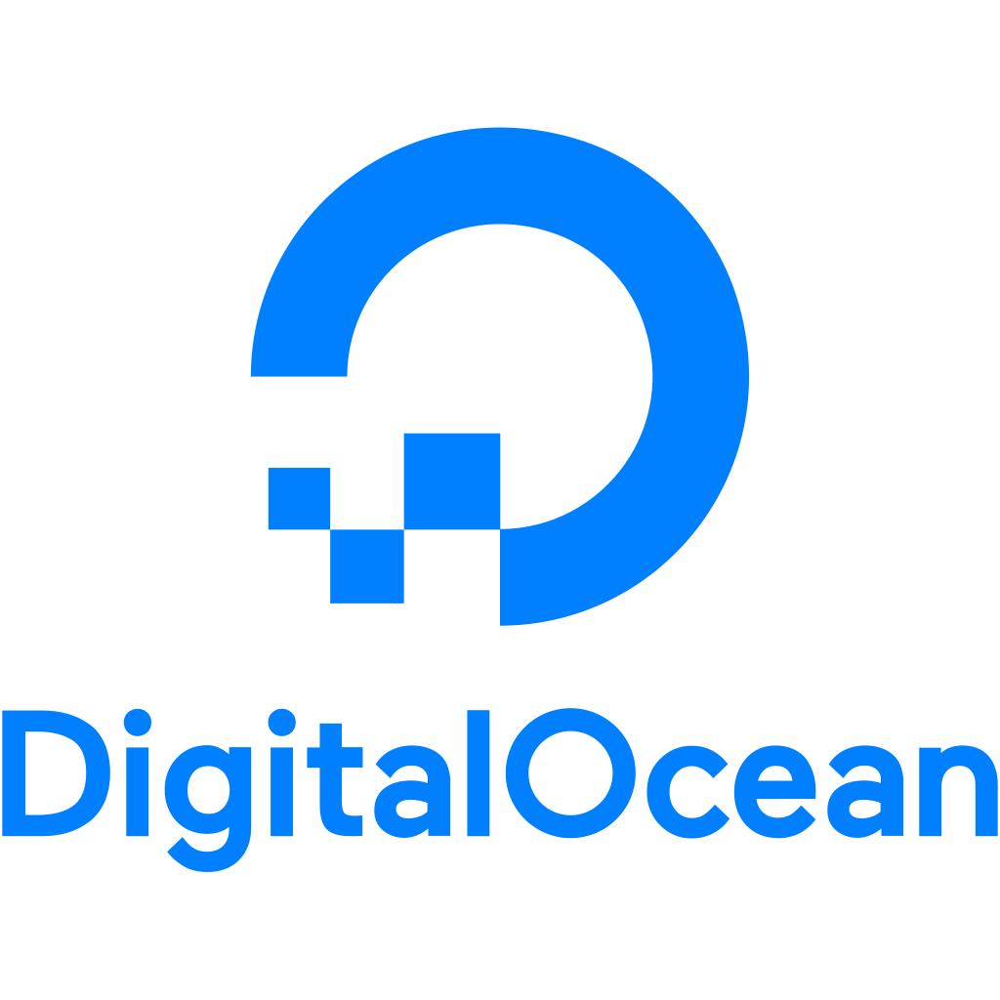

# Tiny K8s learning series

In this tiny K8s learning series, I'll be continue the series of tiny-learning projects from a [previous Docker Repo](https://github.com/AlejandroSobral/Docker-learning).

### 0: Local Minikube

Beginning means working locally with Minikube. At this step, the minimum will be deployed to have a tiny but fully operative cluster.
A single MongoDB instance and two web-front replicas will be deployed.
A simple service to access Web.

  

    
  

### 1: Cloud Kubernetes deployment

At this step the deployment will occurr on the Cloud. Particularly in Digital Ocean. A cloud provider.
Don't worry for billing, try this 200 USD trial at [Digital Ocean](https://m.do.co/c/d67ad98bbcf8).

tiny-web:1.19 alesb/tiny-web:v1.0
docker tag mongodb:v1.1 alesb/tiny-mongo:v1.0

docker push alesb/tiny-mongo:v1.0
docker push alesb/tiny-web:v1.0

  

    
  

### 2: AWS Deployment

This step deploys the same images that the previous one. But with the requirements that AWS has, such as PVC, node-groups, etc.

  

    
  

